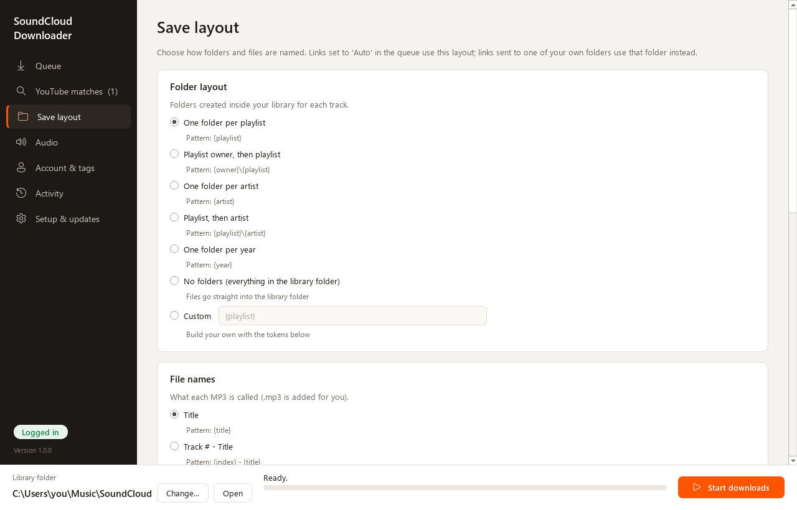
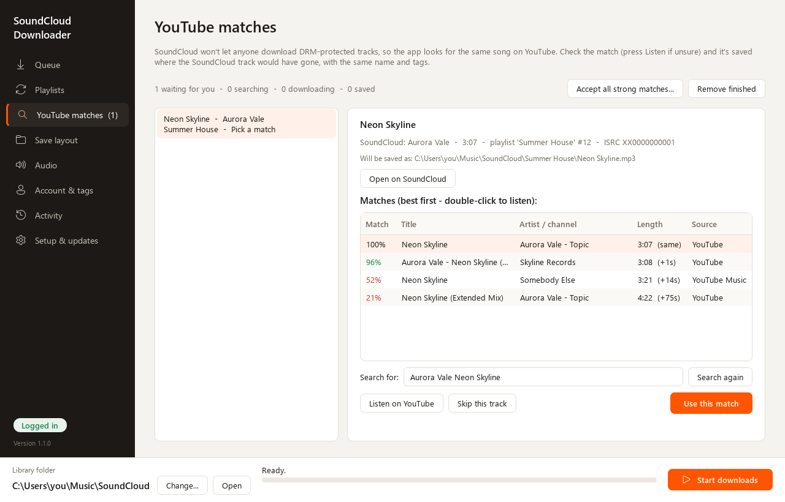

# SoundCloud Downloader (scdl-gui)

A friendly Windows app for saving SoundCloud playlists, likes and tracks as high-quality, tagged MP3s -
organised into folders exactly the way you want. Built on [scdl](https://github.com/scdl-org/scdl) and
[yt-dlp](https://github.com/yt-dlp/yt-dlp).

> Unofficial - not affiliated with or endorsed by SoundCloud or YouTube. Only download music you have the
> right to keep, and respect artists and each site's terms of service.

## Features

- **Paste and go** - playlists, albums, your likes, profiles, stations, single tracks and `on.soundcloud.com`
  share links. Names are looked up for you.
- **Folders your way** - one folder per playlist by default, or build your own layout and file names from
  tokens like `{playlist}`, `{artist}`, `{index}`, with a live preview. Make your own folders and drag links
  into them, or send them anywhere on your PC.
- **Best quality** - uses your SoundCloud login (Go+ gets 256k AAC) or the artist's original upload, and
  converts to MP3 (V0, 320, 256, V2 or 192).
- **Even volume** - optional EBU R128 loudness levelling so every song plays equally loud, done in the same
  encode (no extra quality loss).
- **Full tags** - title, artist, album = playlist, track number, date, genre, source link and full-size cover art.
- **Never downloads twice** - remembers what you already have (shared or per-folder), and gets every track
  of each link even if it's in several playlists, if you prefer.
- **DRM-protected tracks** - finds the same song on YouTube, scores the matches, and saves your choice in the
  right place with the SoundCloud tags. Nothing is downloaded until you confirm it. With YouTube Music
  Premium, one click sets up automatic PO tokens for 256k+ audio.
- **Friendly with SoundCloud** - few requests per track, paced under the rate limit, and waits out a
  "too many requests" answer instead of skipping tracks.
- **Keeps itself up to date** - checks GitHub for new versions and updates in place.

| Save layout | YouTube matches |
| --- | --- |
|  |  |

## Install

### The easy way (no Python needed)

1. Download **`scdl-gui-windows-x64.zip`** from the [latest release](https://github.com/kaidenk24/scdl-gui/releases/latest).
2. Unzip it anywhere you like (e.g. `Documents\scdl-gui`) and run **`scdl-gui.exe`**.
   Windows SmartScreen may warn about an unknown publisher - choose *More info -> Run anyway*.
3. On first start the app offers to add Start menu and desktop shortcuts, and to install **FFmpeg**
   (needed to make MP3s) with one click.


### From source

Needs Windows 10/11 and [Python 3.10+](https://www.python.org/downloads/).

```bat
git clone https://github.com/kaidenk24/scdl-gui.git
cd scdl-gui
run.bat
```

`run.bat` sets up everything on first launch and keeps the components current. If you cloned with git, the
app updates itself with `git pull` when a new version is out.

## Using it

1. **Queue** - paste links (or *Paste from clipboard* / *Import .txt*). Choose where each one goes in
   *Save to*, or drag links onto a folder in the Folders panel. *Auto* follows the Save layout.
2. **Save layout** - folder structure, file names and how already-downloaded tracks are handled.
3. **Audio** - MP3 quality, *Even out volume*, original uploads, previews, and *only the first N tracks*.
4. **Account & tags** - which browser to borrow your SoundCloud/YouTube login from, and tag options.
5. Press **Start downloads**. **Activity** shows every saved, skipped and failed track.
6. **YouTube matches** - confirm replacements for DRM-protected tracks (*Listen* first if unsure).

### Logins

The app never asks for a password. It borrows your existing login cookies from your browser (via yt-dlp).
Firefox works best: recent Chrome/Edge/Brave versions encrypt their cookies, which often can't be read -
close the browser first, or use Firefox.

### YouTube matches

Needs [Node.js](https://nodejs.org) (one-click install on the Setup & updates page). Without extra setup
YouTube gives ~130-140 kbps audio.

**YouTube Music Premium:** on Setup & updates, press *Set up automatic PO tokens*. The app downloads the
[bgutil-ytdlp-pot-provider](https://github.com/Brainicism/bgutil-ytdlp-pot-provider) token generator
(GPL-3.0, ~100 MB, runs through Node.js) into its data folder, and from then on YouTube matches download at
256k AAC / 282k Opus. It updates itself daily. A [PO token](https://github.com/yt-dlp/yt-dlp/wiki/PO-Token-Guide)
can also be pasted by hand on Account & tags.

## Where things are

| What | Where |
| --- | --- |
| Settings, queue, logs | `%APPDATA%\SoundCloud Downloader\` |
| PO-token generator (if set up) | `%APPDATA%\SoundCloud Downloader\potoken\` |
| Downloaded music | your library folder (default `Music\SoundCloud`) |
| Failed tracks | `soundcloud-failed.txt` in the library folder |
| "Already downloaded" list | `download_archive.txt` (or `.archives\`) in the library folder |

## Troubleshooting

- **"FFmpeg wasn't found"** - Setup & updates -> *Install FFmpeg for me*.
- **Go+ tracks fail / 30-second previews** - log in to SoundCloud in your browser, then *Check again* on
  Account & tags.
- **Everything suddenly fails** - SoundCloud or YouTube changed something. Update the app (Setup & updates ->
  *Check for updates now*).
- **Something else** - the Activity page explains what went wrong (tick *Show technical details* for the
  full output), and `app.log` is in Setup & updates -> *Open settings & logs folder*.

## License

GPL-2.0-or-later - see [LICENSE](LICENSE). Uses [scdl](https://github.com/scdl-org/scdl) (GPL-2.0),
[yt-dlp](https://github.com/yt-dlp/yt-dlp) (Unlicense), [mutagen](https://github.com/quodlibet/mutagen)
(GPL-2.0+) and [Qt for Python / PySide6](https://doc.qt.io/qtforpython/) (LGPL-3.0). The Windows app
bundles these libraries unmodified; FFmpeg, Node.js and the optional PO-token generator (GPL-3.0) are not
bundled - they're downloaded from their official sources only when you choose to set them up.
