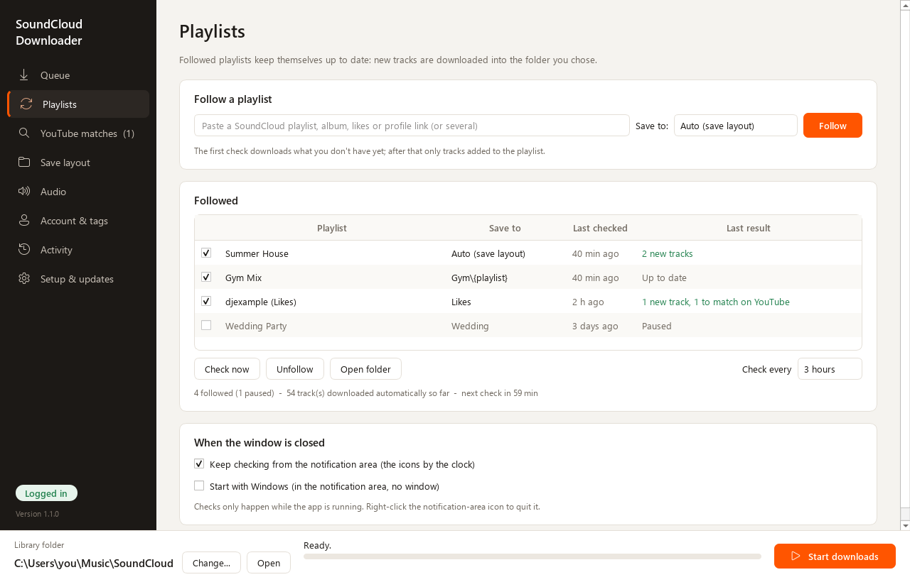

# SoundCloud Downloader (scdl-gui)

I wanted my SoundCloud playlists as proper MP3s in my music library - sorted into folders, tagged, with the
cover art - without babysitting a command line every time a playlist got a new song. So I built this. It's a
Windows app on top of [scdl](https://github.com/scdl-org/scdl) and [yt-dlp](https://github.com/yt-dlp/yt-dlp):
you paste links, pick where they go, and it does the rest.

> Unofficial - not affiliated with or endorsed by SoundCloud or YouTube. Only download music you have the
> right to keep, and respect artists and each site's terms of service.

| Playlists | YouTube matches |
| --- | --- |
|  |  |

## What it does

**Paste and go.** Throw anything at the Queue: playlists, albums, your likes, a whole profile, stations, single
tracks, `on.soundcloud.com` share links - or a whole block of text, it picks the links out for you. It looks up
the playlist names too, so you're not staring at URLs.

**Follow your playlists and forget about them.** This is my favourite part. On the Playlists page you follow a
playlist (or your likes, or a profile), pick its folder, and that's it - every few hours (1 to 24, you choose)
the app checks it and downloads whatever got added since last time. Close the window and it keeps going from
the notification area by the clock; tick *Start with Windows* and you never have to think about it again. It
never fights with downloads you start yourself, it waits if your music drive isn't plugged in, and if a check
fails because the Wi-Fi wasn't back yet, it tries again 15 minutes later instead of waiting hours.

**Folders the way you like them.** By default each playlist gets its own folder. If you want something else,
the Save layout page lets you build folder and file names from tokens like `{playlist}`, `{artist}`, `{year}`
and `{index}`, with a live preview so you can see exactly where a song will land. You can also make your own
folders and just drag links onto them, or send a link anywhere on your PC.

**The best audio SoundCloud will give you.** It borrows your SoundCloud login from your browser, so a Go+
account gets the 256k AAC streams, and when an artist allows downloads it grabs their original upload instead.
That gets converted to MP3 at the quality you pick (V0, 320, 256, V2 or 192).

**Every song at the same volume.** Turn on *Make all songs the same loudness* and every track is levelled to
the same EBU R128 loudness - Quiet, Standard (Spotify/YouTube level), Loud or Club. It happens in the same
encode, so it costs no extra quality.

**Tagged properly.** Title, artist, date, genre, the SoundCloud link and full-size cover art go into every
file. The Album tag is the song's own title by default, because otherwise iTunes and Apple Music lump a whole
playlist under one cover - but you can switch to the playlist name, and fix up files you already have with
one button.

**Never downloads the same thing twice.** It remembers what you've got. You choose whether a song that's in
three playlists is saved once, or once in each playlist's folder.

**Handles the songs SoundCloud won't let anyone download.** Some label releases are DRM-protected. For those
the app searches YouTube and YouTube Music, scores what it finds (title, artist, length, and whether it's an
official upload) and lays it out on the YouTube matches page. You can listen first, and nothing is downloaded
until you say so. The file still ends up where the SoundCloud track would have gone, with its tags. If you have
YouTube Music Premium, one click sets up automatic PO tokens and you get 256k audio from YouTube too.

**Nice to SoundCloud.** It keeps the number of requests per track low, paces itself under the rate limit, and
when SoundCloud says "slow down" it waits it out instead of skipping your tracks.

**Looks after itself.** It checks GitHub for new versions and updates in place, sets up FFmpeg and Node.js
with one click each, and the layout adapts to whatever screen you're on - from a small laptop to a big
monitor.

## Getting it

### The easy way (no Python needed)

1. Download **`scdl-gui-windows-x64.zip`** from the [latest release](https://github.com/kaidenk24/SCDL-GUI-AIO/releases/latest).
2. Unzip it anywhere (e.g. `Documents\scdl-gui`) and run **`scdl-gui.exe`**. Windows SmartScreen may complain
   about an unknown publisher - hit *More info -> Run anyway*.
3. The first time it starts, it offers Start menu and desktop shortcuts and a one-click install of
   **FFmpeg**, which it needs to make MP3s.

### From source

You'll need Windows 10/11 and [Python 3.10 or newer](https://www.python.org/downloads/).

```powershell
git clone https://github.com/kaidenk24/SCDL-GUI-AIO.git
cd SCDL-GUI-AIO
.\run.bat
```

(Double-clicking `run.bat` in File Explorer works too.) The first launch downloads about 150 MB and takes a few
minutes - if it gets interrupted, it just starts over next time. After that, `run.bat` keeps the components up
to date by itself, and a git clone updates with `git pull` when there's a new version.

## How I use it

1. **Queue** - paste links (or *Paste from clipboard* / *Import .txt*). Pick where each one goes in the
   *Save to* column, or drag it onto a folder in the Folders panel. *Auto* follows your Save layout.
2. **Save layout** - how folders and files are named, and how tracks you already have are handled.
3. **Audio** - MP3 quality, loudness levelling, original uploads, Go+ previews, and *only the first N tracks*
   (handy for "my latest 50 likes").
4. **Account & tags** - which browser to borrow your SoundCloud/YouTube login from, and what goes into the tags.
5. Hit **Start downloads**. The **Activity** page shows everything that was saved, skipped or failed.
6. **YouTube matches** - confirm replacements for DRM-protected tracks (*Listen* first if you're unsure).
7. **Playlists** - paste a link, pick its folder, hit *Follow*. Or right-click links in the Queue and choose
   *Follow*. The first check grabs whatever you don't have yet; after that it's only new tracks.

### About logins

The app never asks for a password. It borrows the login cookies your browser already has (through yt-dlp).
Firefox works best - recent Chrome, Edge and Brave encrypt their cookies in a way that often can't be read, so
close the browser first or use Firefox.

### About followed playlists

Checks only happen while the app is running. With *Keep checking from the notification area* on (it is by
default), closing the window leaves the app running down by the clock - right-click its icon to really quit.
*Start with Windows* puts a shortcut in your Startup folder that opens the app there, without a window.
Opening the app again while it's running just brings the window back.

### About YouTube matches

These need [Node.js](https://nodejs.org) (one-click install on Setup & updates). Out of the box YouTube gives
about 130-140 kbps audio.

With **YouTube Music Premium**, press *Set up automatic PO tokens* on Setup & updates. The app downloads the
[bgutil-ytdlp-pot-provider](https://github.com/Brainicism/bgutil-ytdlp-pot-provider) token generator
(GPL-3.0, about 100 MB, runs on Node.js) into its data folder, and from then on matches come down at 256k AAC /
282k Opus. It keeps itself updated. If you'd rather, you can paste a
[PO token](https://github.com/yt-dlp/yt-dlp/wiki/PO-Token-Guide) by hand on Account & tags.

## Where things are

| What | Where |
| --- | --- |
| Settings, queue, followed playlists, logs | `%APPDATA%\SoundCloud Downloader\` |
| PO-token generator (if set up) | `%APPDATA%\SoundCloud Downloader\potoken\` |
| Your music | your library folder (default `Music\SoundCloud`) |
| Tracks that failed | `soundcloud-failed.txt` in the library folder |
| The "already downloaded" list | `download_archive.txt` (or `.archives\`) in the library folder |

## When something goes wrong

- **"FFmpeg wasn't found"** - Setup & updates -> *Install FFmpeg for me*.
- **Go+ tracks fail, or you get 30-second previews** - log in to SoundCloud in your browser, then press
  *Check again* on Account & tags.
- **Everything suddenly fails** - SoundCloud or YouTube changed something on their end. Update the app
  (Setup & updates -> *Check for updates now*); yt-dlp usually catches up fast.
- **A followed playlist says "Waiting for the library folder"** - the drive your library is on isn't
  connected. Plug it back in and the check runs on its own.
- **Anything else** - the Activity page says what went wrong (tick *Show technical details* for the full
  output), and `app.log` is under Setup & updates -> *Open settings & logs folder*.

## License

GPL-2.0-or-later - see [LICENSE](LICENSE). It uses [scdl](https://github.com/scdl-org/scdl) (GPL-2.0),
[yt-dlp](https://github.com/yt-dlp/yt-dlp) (Unlicense), [mutagen](https://github.com/quodlibet/mutagen)
(GPL-2.0+) and [Qt for Python / PySide6](https://doc.qt.io/qtforpython/) (LGPL-3.0). The Windows app bundles
those libraries unmodified. FFmpeg, Node.js and the optional PO-token generator (GPL-3.0) aren't bundled -
they're downloaded from their official sources only when you choose to set them up.
